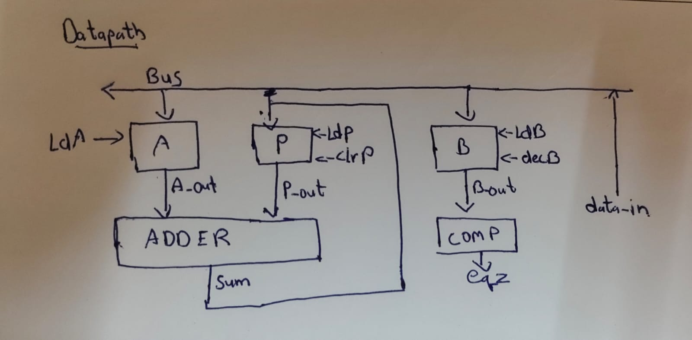

# FSM-Based Sequential Multiplier Using Datapath and Control Path (Verilog)

## Overview

This project implements a **Sequential Multiplier** using the **Datapath and Control Path design methodology** in Verilog HDL.

The multiplication is performed using the **Repeated Addition Algorithm**, where:

- Multiplicand (A) is loaded into a register.
- Multiplier (B) is loaded into a counter.
- Product register (P) is initialized to zero.
- The controller repeatedly:
  - Adds A to P
  - Decrements B
- When B becomes zero, multiplication is complete.

The design demonstrates the separation of:

1. **Datapath**
2. **Control Path (FSM Controller)**
---

## Algorithm

```text
Load A
Load B
Clear Product P

while(B != 0)
{
    P = P + A
    B = B - 1
}

Result = P
```

---

## Datapath Architecture

The datapath consists of:

- 16-bit Multiplicand Register (A)
- 16-bit Multiplier Counter (B)
- 32-bit Product Register (P)
- 32-bit Adder
- Comparator (B == 0)

### Datapath Diagram



---

## Control Path (FSM)

The controller generates the required control signals for the datapath.

### States

| State | Description |
|---------|-------------|
| S0 | Idle |
| S1 | Load Multiplicand |
| S2 | Load Multiplier & Clear Product |
| S3 | Check if B = 0 |
| S4 | Add A to P and Decrement B |
| S5 | Done |

### FSM Diagram

S0(IDLE)
   |
 start
   v
S1(Load A)
   |
   v
S2(Load B, Clear P)
   |
   v
S3(Check B)
   |
eqz=0
   v
S4(Add & Dec)
   |
   +------> S3

eqz=1
   |
   v
S5(DONE)
   |
 $finish

---

## Control Signals

| Signal | Function |
|----------|-----------|
| ldA | Load Multiplicand Register |
| ldB | Load Multiplier Register |
| ldP | Load Product Register |
| clrP | Clear Product Register |
| decB | Decrement Counter B |
| done | Multiplication Complete |
| eqz | Indicates B = 0 |

---

## Compilation

Using Icarus Verilog:

```bash
iverilog -o MUL.vvp test_bench.v
vvp MUL.vvp
```

---

## Waveform Viewing

Open GTKWave:

```bash
gtkwave MUL.vcd
```

---

## Example

### Input

```text
A = 17
B = 6
```

### Operation

```text
P = 0

P = 17
P = 34
P = 51
P = 68
P = 85
P = 102
```

### Output

```text
Product = 102
```

---

## Learning Outcomes

This project demonstrates:

- Finite State Machine (FSM) Design
- Datapath and Control Path Separation
- Sequential Multiplication

---

## Tools Used

- Verilog HDL
- Icarus Verilog
- GTKWave
- Visual Studio Code

---
