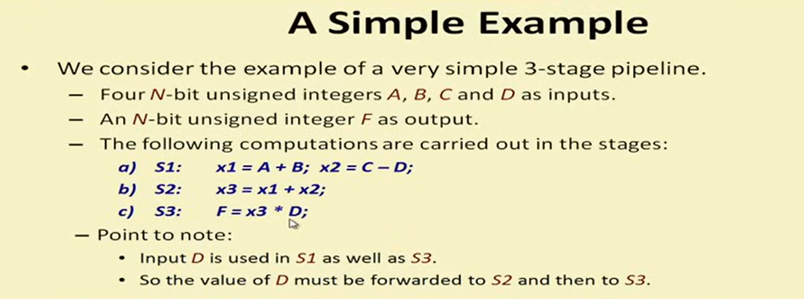
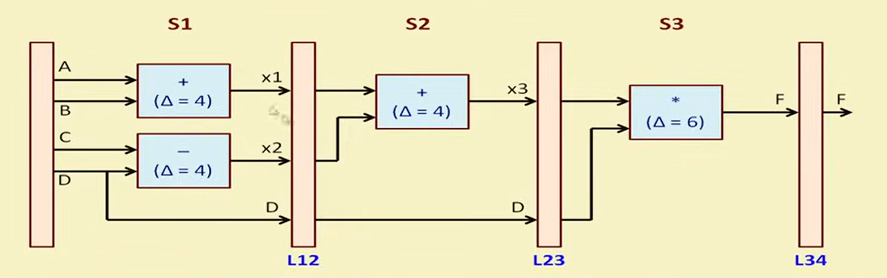

# Simple 3-Stage Pipeline in Verilog

## Overview

This project implements a **simple 3-stage pipeline** in Verilog HDL. It demonstrates how a computation can be divided into multiple stages using **pipeline registers** so that different sets of inputs can be processed simultaneously.

---

## Problem Statement

The pipeline performs the following operations on four **N-bit** inputs (**A, B, C, D**):

```text
Stage 1:
x1 = A + B
x2 = C - D

Stage 2:
x3 = x1 + x2

Stage 3:
F = x3 × D
```

### Example



---

## Pipeline Architecture

The design consists of three pipeline stages separated by pipeline registers.

- **Stage 1:** Computes `A + B` and `C - D`.
- **Stage 2:** Adds the two intermediate results.
- **Stage 3:** Multiplies the result by `D` to produce the final output.

Since **D** is required in both Stage 1 and Stage 3, it is forwarded through the pipeline registers.



---

## Pipeline Registers

| Register | Stores |
|----------|--------|
| L12 | x1, x2, D |
| L23 | x3, D |
| L34 | Final output F |

---

## Simulation

Compile the design:

```bash
iverilog -o pipeline.vvp pipeline_simple_example.v pipeline_test.v
```

Run the simulation:

```bash
vvp pipeline.vvp
```

View the waveform:

```bash
gtkwave pipeline_simple.vcd
```

---

## Learning Outcomes

- Basic pipelining concept
- Pipeline register implementation
- Multi-stage data processing
- Parameterized Verilog design
- Simulation using Icarus Verilog and GTKWave

---

## Tools Used

- Verilog HDL
- Icarus Verilog
- GTKWave
- Visual Studio Code