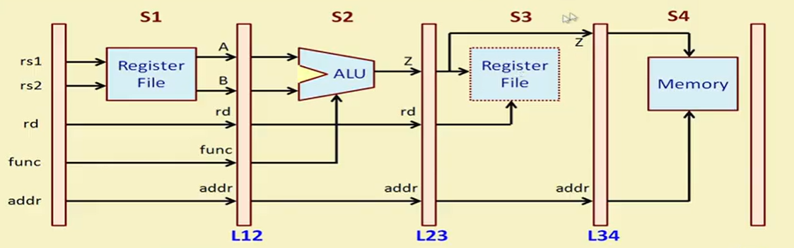

# 4-Stage Structural Pipeline Example

This repository contains a basic hardware implementation of a **4-stage structural pipeline** written in Verilog. It demonstrates how instructions flow through individual processing stages step-by-step using a two-phase, non-overlapping clocking scheme (`clk1` and `clk2`).

---

## 📌 Problem Overview

The objective is to design a hardware circuit that takes register addresses, an ALU function code, and a memory destination, processing them across 4 distinct execution stages to prevent propagation bottlenecks.

### ⏱️ Stage-Wise Operations

Every instruction goes through these specific hardware steps as outlined in the functional requirements:


*Figure 1: Architectural description and stage-wise behavioral requirements of the 4-stage pipeline.*

1. **Stage 1 (S1) | Fetch & Read:** Reads two 16-bit values from the internal Register File (`regbank`) at addresses specified by `rs1` and `rs2`. The values are held in pipeline registers `A` and `B`.
2. **Stage 2 (S2) | Execute:** An Arithmetic Logic Unit (ALU) performs an operation (addition, subtraction, shift, etc.) on `A` and `B` based on the operational code (`func`). The result is saved to pipeline register `Z`.
3. **Stage 3 (S3) | Register Write-Back:** The calculated result `Z` is written back into the Register File at destination index `rd`.
4. **Stage 4 (S4) | Memory Write:** Simultaneously, the result `Z` is stored into an external data Memory array (`mem`) at location `addr`.

---

## 🏗️ Hardware Architecture & Datapath

The design relies on intermediate isolation registers (latches) between each stage to safely pass values on alternating clock edges without data corruption or race conditions.


*Figure 2: Hardware datapath schematic showing execution stages (S1–S4) isolated by intermediate pipeline registers (L12, L23, L34).*

### Pipeline Isolation Boundaries
* **`L12` Registers:** Buffer signals traveling from Stage 1 to Stage 2 (`L12_A`, `L12_B`, `L12_rd`, `L12_func`, `L12_addr`).
* **`L23` Registers:** Buffer signals traveling from Stage 2 to Stage 3 (`L23_Z`, `L23_rd`, `L23_addr`).
* **`L34` Registers:** Buffer signals traveling from Stage 3 to Stage 4 (`L34_Z`, `L34_addr`).

### Two-Phase Clock Strategy
To isolate alternating execution boundaries cleanly, the pipeline splits work across two distinct clock phases:
* **`clk1`** triggers operations in **Stage 1** and **Stage 3**.
* **`clk2`** triggers operations in **Stage 2** and **Stage 4**.

---

## 📁 File Structure

* **`pipeline_example.v`**: The core structural design module containing the behavioral logic blocks for all four stages.
* **`pipe_test.v`**: The simulation testbench that feeds test instruction vectors, models the dual-phase clock, initializes registers, and displays memory results.

---

## 🚀 How to Run the Simulation

You can compile and run this design using any standard Verilog simulator (such as Icarus Verilog or ModelSim).

### Using Icarus Verilog (`iverilog`):

1. **Compile the design and testbench files:**
   ```bash
   iverilog -o pipeline_sim pipe_test.v pipeline_example.v